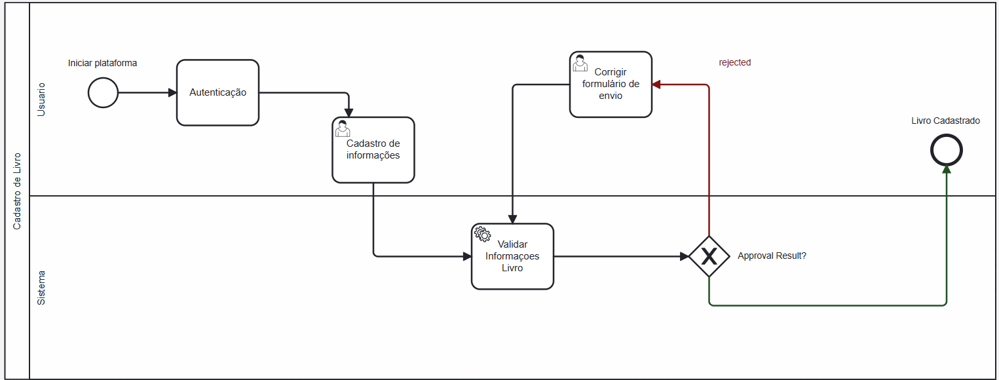

### 3.3.1 Processo 1 – Cadastro livros

#### Detalhamento das atividades

- O processo é iniciado pelo usuário.
- O usuário precisa se autenticar para acessar o sistema.
- O usuário insere informações sobre o livro no sistema. 
- O sistema automaticamente valida as informações do livro inseridas, se as informações não passarem na validação, o usuário tem a oportunidade de corrigir o formulário de envio. 
- As informações sendo validadas com sucesso, o livro é considerado cadastrado. 
- As decisões são baseadas na validação das informações do livro. Se a validação falhar, o processo volta para a correção do formulário. 
- Se for bem-sucedida, o livro é cadastrado no sistema.

_Os tipos de dados a serem utilizados são:_

 **Área de texto** - Para descrição detalhada do livro

 **Caixa de texto** - Para título do livro

 **Número** - ISBN do livro_

 **Data** - Para data de publicação do livro (dd-mm-aaaa)

 **Hora** - Para hora de publicação do livro (hh:mm:ss)

 **Data e Hora** - Data e Hora de publicação (dd-mm-aaaa, hh:mm:ss)

 **Imagem** - Para upload da capa do livro

 **Seleção única** - campo com várias opções de valores que são mutuamente exclusivas (tradicional radio button ou combobox)

 **Seleção múltipla** - campo com várias opções que podem ser selecionadas mutuamente (tradicional checkbox ou listbox)

 **Arquivo** -Para upload e validação de livros

 **Link** - Para inserção de referências ou links relevantes ao livro

 **Tabela** - campo formado por uma matriz de valores

**Autenticação**

| **Campo** | **Tipo**       | **Restrições**                               | **Valor default** |
| --------- | -------------- | -------------------------------------------- | ----------------- |
| login     | Caixa de Texto | formato de e-mail                            |                   |
| senha     | Caixa de Texto | mínimo de 8 caracteres com numeros e simbolo |                   |

| **Comandos** | **Destino**                   | **Tipo** |
| ------------ | ----------------------------- | -------- |
| entrar       | default                       |          |
| cadastrar    | Início do proceso de cadastro |          |

**Cadastro de Informações**

| **Campo**     | **Tipo**       | **Restrições**       | **Valor default** |
| ------------- | -------------- | -------------------- | ----------------- |
| Nome          | Caixa de Texto |                      |                   |
| Descição      | Caixa de Texto | mínimo 20 caracteres |                   |
| ISBN          | Numero         |                      |                   |
| Publicação    | Data           |                      |                   |
| Capa do Livro | Imagem         | maximo 5mb           |                   |
| Arquivo       | PDF            | maximo 100mb         |                   |
|               |                |                      |                   |

| **Comandos** | **Destino**                        | **Tipo** |
| ------------ | ---------------------------------- | -------- |
| Enviar       | Validação de informações (interno) | boolean  |
|              |                                    |          |

**Corrigir formulario de envio**

| **Campo**     | **Tipo**       | **Restrições** | **Valor default** |
| ------------- | -------------- | -------------- | ----------------- |
| Nome          | Caixa de Texto |                |                   |
| Descição      | Caixa de Texto |                |                   |
| ISBN          | Numero         |                |                   |
| Publicação    | Data           |                |                   |
| Capa do Livro | Imagem         |                |                   |
| Arquivo       | PDF            |                |                   |
|               |                |                |                   |

| **Comandos** | **Destino**                        | **Tipo** |
| ------------ | ---------------------------------- | -------- |
| Enviar       | Validação de informações (interno) | boolean  |
|              |                                    |          |
