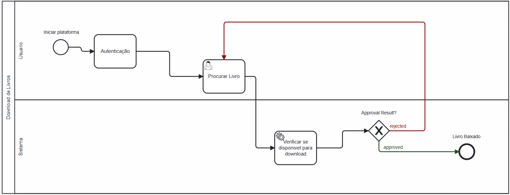

### 3.3.2 Processo 2 – Download livros

#### Detalhamento das atividades

- Autenticação: Uma tarefa de usuário, indicada pelo ícone de pessoa, onde o usuário precisa se autenticar na plataforma.
- Procurar Livro: Uma tarefa subsequente que indica a ação do usuário de buscar um livro específico.
- Verificar se disponível para download: Uma tarefa de serviço, representada pelo engrenagem, onde o sistema verifica automaticamente a disponibilidade do livro para download.
- Approval Result?: Um gateway exclusivo, onde ocorre a decisão com base na disponibilidade do livro:
  
  Se rejeitado, o processo segue para um fim de evento de erro, ou que o livro não está disponível para download.
 
  Se aprovado, o processo permite prosseguir para o download do livro.

_Os tipos de dados a serem utilizados são:_

 **Área de texto** - Permitir pesquisas com palavras-chave.

 **Imagem** - Para mostrar capa do livro.

 **Seleção única** - Filtrar categorias especificas de livros, como gênero ou autor.

 **Arquivo** - Para arquivo do livro que será baixado.

 **Link** - Para recurso de visualização do livro, se disponível.

 **Tabela** - campo formado por uma matriz de valores

**Autenticação**

| **Campo** | **Tipo**       | **Restrições**                               | **Valor default** |
| --------- | -------------- | -------------------------------------------- | ----------------- |
| login     | Caixa de Texto | formato de e-mail                            |                   |
| senha     | Caixa de Texto | mínimo de 8 caracteres com numeros e simbolo |                   |

| **Comandos** | **Destino**                   | **Tipo** |
| ------------ | ----------------------------- | -------- |
| entrar       | default                       |          |
| cadastrar    | Início do proceso de cadastro |          |

**Procurar Livro**

| **Campo** | **Tipo**       | **Restrições** | **Valor default** |
| --------- | -------------- | -------------- | ----------------- |
| Pesquisa  | Campo de texto |                |                   |
|           |                |                |                   |

| **Comandos** | **Destino**                         | **Tipo**            |
| ------------ | ----------------------------------- | ------------------- |
| Pesquisar    | Pagina de detalhes do livro         | (default/cancel/  ) |
| Download     | Verificação se disponivel (interno) |                     |

