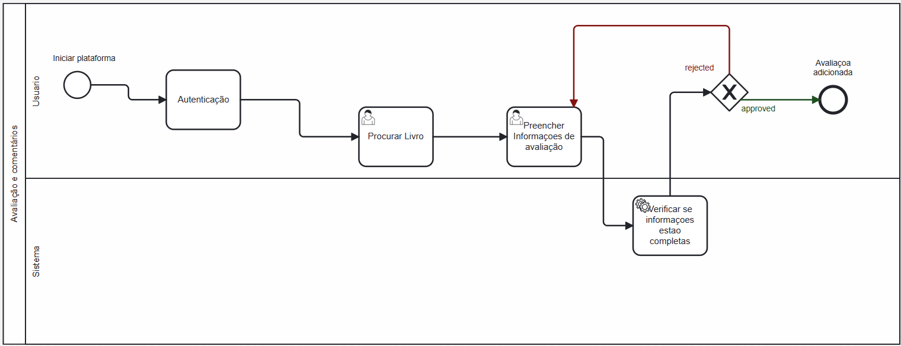

### 3.3.3 Processo 3 – Avaliação e comentarios

#### Detalhamento das atividades

- O usuário entra na plataforma online.
- Autenticação: O usuário se autentica, geralmente inserindo um nome de usuário e senha.
- Procurar Livro: O usuário busca o livro que deseja avaliar, digitando detalhes em uma caixa de texto. Preencher Informações de avaliação: O usuário insere sua avaliação e comentários em uma área de texto e seleciona uma nota de avaliação de uma lista de opções.
- Verificar se informações estão completas: O sistema automaticamente confirma se todos os campos necessários da avaliação foram preenchidos.
- Resultado: Se as informações estiverem completas, a avaliação é adicionada; se não, o processo é rejeitado e pode ser solicitado ao usuário que complete as informações faltantes.

_Os tipos de dados a serem utilizados são:_

 **Área de texto**: - Para inserir comentários sobre o livro (na etapa de preenchimento de informações de avaliação).
 
 **Caixa de texto**:

   - Para o nome de usuário (na autenticação).
   - Para a senha (na autenticação, campo protegido).
   - Para inserir detalhes como título, autor, ou ISBN para pesquisa (na busca por livro).

 **Data e Hora** - Para registrar automaticamente quando a avaliação foi submetida (ao preencher informações de avaliação).

 **Seleção única** - Para escolher uma nota de avaliação de uma lista de opções numéricas (ao preencher informações de avaliação).

 **Seleção múltipla**: - Para escolher tags ou categorias relacionadas ao livro (ao preencher informações de avaliação, opcional).

**Autenticação**

| **Campo** | **Tipo**       | **Restrições**                               | **Valor default** |
| --------- | -------------- | -------------------------------------------- | ----------------- |
| login     | Caixa de Texto | formato de e-mail                            |                   |
| senha     | Caixa de Texto | mínimo de 8 caracteres com numeros e simbolo |

| **Comandos** | **Destino**                   | **Tipo** |
| ------------ | ----------------------------- | -------- |
| entrar       | default                       |          |
| cadastrar    | Início do proceso de cadastro |          |

**Procurar Livro**

| **Campo** | **Tipo**       | **Restrições** | **Valor default** |
| --------- | -------------- | -------------- | ----------------- |
| Pesquisa  | Campo de texto |                |                   |
|           |                |                |                   |

| **Comandos** | **Destino**                 | **Tipo**            |
| ------------ | --------------------------- | ------------------- |
| Pesquisar    | Pagina de detalhes do livro | (default/cancel/  ) |
| Avaliação    | Formulario de avaliação     |                     |

**Preencher Informações avaliação**

| **Campo**  | **Tipo**       | **Restrições** | **Valor default** |
| ---------- | -------------- | -------------- | ----------------- |
| Comentario | Campo de texto |                |                   |
| Nota       | Numero         | 1 a 5          |                   |

| **Comandos** | **Destino**                         | **Tipo** |
| ------------ | ----------------------------------- | -------- |
| Enviar       | Verificação de informações(interno) |          |
