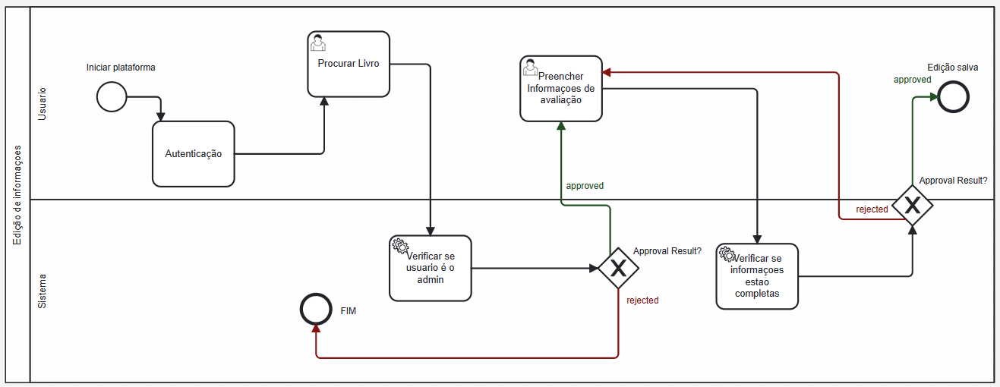

### 3.3.4 Processo 4 – Atualização de informações do livro

#### Detalhamento das atividades

- Acesso inicial à plataforma digital.
- Autenticação: Verificação da identidade do usuário.
- Procurar Livro: Busca pelo livro a ser atualizado.
- Preencher Informações de avaliação: Inserção ou atualização das informações de um livro.
- Verificar se usuário é admin: Confirmação de privilégios de administrador para fazer mudanças.
- Approval Result?: Decisão sobre se a atualização será aceita ou rejeitada.
- Edição salva: Se aprovada, a informação é atualizada no sistema.
- Verificar se informações estão completas:

    Se rejeitada, é verificado se todas as informações necessárias foram fornecidas.
  
    Se as informações estiverem completas, o processo termina. Caso contrário, ele retorna para que o usuário preencha os dados faltantes.

_Os tipos de dados a serem utilizados são:_

 **Área de texto**: - Para comentários sobre o livro (ao preencher informações de avaliação).

 **Caixa de texto**: _ Para o nome de usuário (na autenticação).
                       - Para a senha (na autenticação, deve ser protegida e oculta na interface do usuário).
                       - Para o título do livro ou outros critérios de pesquisa (na busca por livro).
                       - Para editar informações do livro, como autor, editora, sinopse, etc.

 **Número**: - Opcionalmente, para o ano de publicação ou ISBN (na busca por livro).
               - Para a classificação do livro, por exemplo, em uma escala de 1 a 5 (ao preencher informações de avaliação).

 **Data** - Para indicar quando a avaliação foi feita (ao preencher informações de avaliação).

 **Seleção única**: - Para o tipo de busca, por exemplo, título, autor, ou ISBN (na busca por livro).

 **Seleção múltipla**: - Para escolher tags ou categorias relacionadas ao livro (ao preencher informações de avaliação).
                         - Para o tipo de busca, por exemplo, título, autor, ou ISBN (na busca por livro).

**Autenticação**

| **Campo** | **Tipo**       | **Restrições**                               | **Valor default** |
| --------- | -------------- | -------------------------------------------- | ----------------- |
| login     | Caixa de Texto | formato de e-mail                            |                   |
| senha     | Caixa de Texto | mínimo de 8 caracteres com numeros e simbolo |

| **Comandos** | **Destino**                   | **Tipo** |
| ------------ | ----------------------------- | -------- |
| entrar       | default                       |          |
| cadastrar    | Início do proceso de cadastro |          |

**Procurar Livro**

| **Campo** | **Tipo**       | **Restrições** | **Valor default** |
| --------- | -------------- | -------------- | ----------------- |
| Pesquisa  | Campo de texto |                |                   |
|           |                |                |                   |

| **Comandos** | **Destino**                 | **Tipo**            |
| ------------ | --------------------------- | ------------------- |
| Pesquisar    | Pagina de detalhes do livro | (default/cancel/  ) |
| Editar       | Verificação de admin        |                     |

**Cadastro de Informações**

| **Campo**     | **Tipo**       | **Restrições**       | **Valor default** |
| ------------- | -------------- | -------------------- | ----------------- |
| Nome          | Caixa de Texto |                      |                   |
| Descição      | Caixa de Texto | mínimo 20 caracteres |                   |
| ISBN          | Numero         |                      |                   |
| Publicação    | Data           |                      |                   |
| Capa do Livro | Imagem         | maximo 5mb           |                   |
| Arquivo       | PDF            | maximo 100mb         |                   |
|               |                |                      |                   |

| **Comandos** | **Destino**                        | **Tipo** |
| ------------ | ---------------------------------- | -------- |
| Enviar       | Validação de informações (interno) | boolean  |
| Cancelar     | Pagina info livro                  |          |
