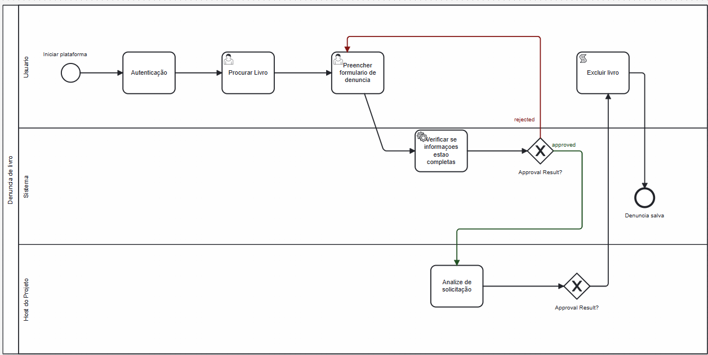

### 3.3.5 Processo 5 – Denuncia

#### Detalhamento das atividades

- Autenticação: Cadastro se nao tiver e Login
- Procurar Livro: Busca o livro que o usuario deseja
- Preencher formulário de denúncia: Preenche o motivo da denuncia
- Verificar se informações estão completas: Se esta completo o formulario e se falta dados
- Análise de solicitação: Host do sistema avalia a solicitação
- Excluir livro (caso aprovado): Livro é excluido do DB

_Os tipos de dados a serem utilizados são:_

 **Área de texto**: - Para a descrição da natureza da denúncia (Preencher formulário de denúncia).

 **Caixa de texto**: - Para o nome de usuário (Autenticação).
                     - Para a senha de usuário (Autenticação, campo protegido)._
                     - Para buscar o livro por detalhes como título, autor, ou ISBN para pesquisa (Procurar Livro).

 **Número**: - Quantidade de itens ou páginas envolvidos na denúncia, se aplicável (Preencher formulário de denúncia).

 **Data**: - Data em que a denúncia foi feita de maneira automática (Preencher formulário de denúncia).

 **Imagem**: - Evidências visuais, daquilo que está sendo denunciado (Preencher formulário de denúncia).

 **Arquivo**: - Upload de documentos adicionais que apoiam a denúncia (Preencher formulário de denúncia). (opcional)

 **Link** - URLs externas que podem corroborar a denúncia (Preencher formulário de denúncia). (opcional)

 **Tabela** - Resultados da pesquisa para seleção do livro (Procurar Livro).

 **Autenticação**

| **Campo** | **Tipo**       | **Restrições**                               | **Valor default** |
| --------- | -------------- | -------------------------------------------- | ----------------- |
| login     | Caixa de Texto | formato de e-mail                            |                   |
| senha     | Caixa de Texto | mínimo de 8 caracteres com numeros e simbolo |

| **Comandos** | **Destino**                   | **Tipo** |
| ------------ | ----------------------------- | -------- |
| entrar       | default                       |          |
| cadastrar    | Início do proceso de cadastro |          |

**Procurar Livro**

| **Campo** | **Tipo**       | **Restrições** | **Valor default** |
| --------- | -------------- | -------------- | ----------------- |
| Pesquisa  | Campo de texto |                |                   |
|           |                |                |                   |

| **Comandos** | **Destino**                 | **Tipo**            |
| ------------ | --------------------------- | ------------------- |
| Pesquisar    | Pagina de detalhes do livro | (default/cancel/  ) |
| Denunciar    | Formulario de denunica      |                     |

**Preencher Informações denuncia**

| **Campo** | **Tipo**       | **Restrições** | **Valor default** |
| --------- | -------------- | -------------- | ----------------- |
| Motivo    | Campo de texto |                |                   |

| **Comandos** | **Destino**                         | **Tipo** |
| ------------ | ----------------------------------- | -------- |
| Enviar       | Verificação de informações(interno) |          |

**Análise de solicitação**

| **Campo**   | **Tipo**       | **Restrições** | **Valor default** |
| ----------- | -------------- | -------------- | ----------------- |
| Comentarios | Campo de texto |                |                   |
| ID          | Texto          |                |                   |
| Data        | Datetime       |                |                   |
| Resultado   | Seleção única  |                |                   |

| **Comandos** | **Destino** | **Tipo** |
| ------------ | ----------- | -------- |
| Enviar       |             |          |

**Excluir livro**

| **Campo**    | **Tipo** | **Restrições** | **Valor default** |
| ------------ | -------- | -------------- | ----------------- |
| ID livro     | Número   |                |                   |
| Data         | Data     |                |                   |
| RegistoLivro | Arquivo  |                |                   |

| **Comandos** | **Destino** | **Tipo** |
| ------------ | ----------- | -------- |
|              |             |          |

