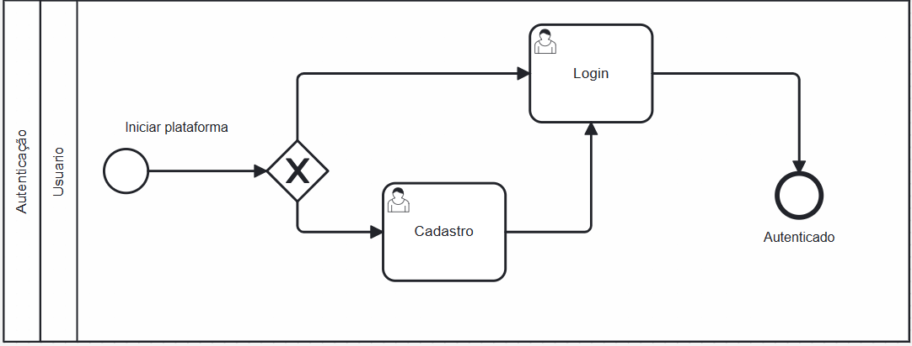

### 3.3.5 Processo 6 – Autenticação

#### Detalhamento das atividades

- Decisão (indicado pelo losango no diagrama): Verifica se ja tem cadastro
- Cadastro: Preencher informaçoes pra cadastro
- Login: Digitar usuario e senha

 Os tipos de dados a serem utilizados são:

 **Área de texto** - campo texto de múltiplas linhas
 
 **Caixa de texto**: - Nome de usuário (Login e Cadastro).
                       - Senha (Login e Cadastro, campo protegido).
                       - Nome completo do usuário (Cadastro).
                       - Endereço de email (Cadastro).
                       - Nome de usuário desejado (Cadastro).

 **Número**:  - Telefone de contato (Cadastro).

 **Data** - Data de nascimento (Cadastro).

 **Imagem** - Foto de perfil (Cadastro). (Opcional)

 **Seleção múltipla**: - Áreas de interesse ou preferências (Cadastro).

 **Link** - Perfil de rede social (Cadastro). (Opcional)

**Login**

| **Campo** | **Tipo**       | **Restrições**         | **Valor default** |
| --------- | -------------- | ---------------------- | ----------------- |
| Login     | Caixa de Texto | formato de e-mail      |                   |
| Senha     | Caixa de Texto | mínimo de 8 caracteres |                   |

| **Comandos** | **Destino**                   | **Tipo** |
| ------------ | ----------------------------- | -------- |
| entrar       | Fim do Processo 6             | default  |
| cadastrar    | Início do proceso de cadastro |          |

**Nome da atividade 2**

| **Campo**  | **Tipo**                      | **Restrições** | **Valor default** |
| ---------- | ----------------------------- | -------------- | ----------------- |
| Usuário    | Caixa de texto                |                |                   |
| E-mail     | Caixa de texto                |                |                   |
| Nome       | Caixa de texto                |                |                   |
| Contato    | Número                        |                |                   |
| Nascimento | Data                          |                |                   |
| Senha      | Caixa de texto formato: Senha |                |                   |
| Foto       | Imagem                        |                |                   |

| **Comandos** | **Destino** | **Tipo**            |
| ------------ | ----------- | ------------------- |
| Cadastrar    | Login       | (default/cancel/  ) |