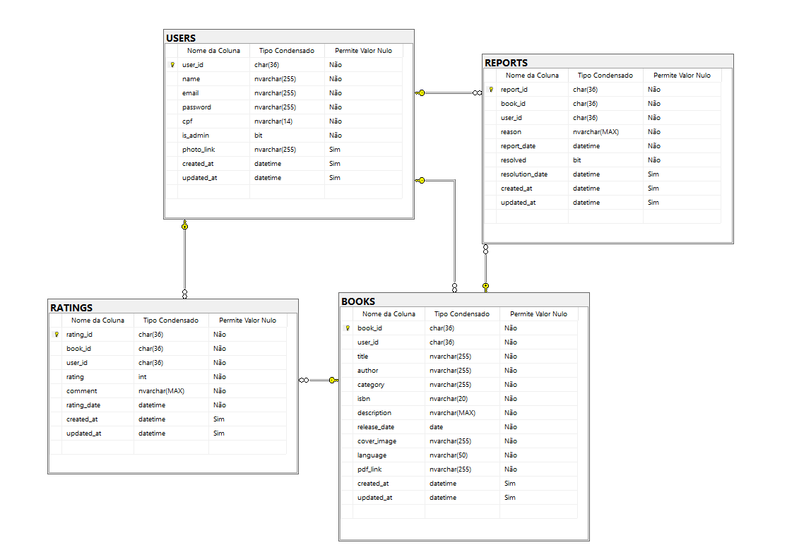

## 4. Projeto da solução

### 4.1. Modelo de dados

---

### 4.2. Tecnologias

| **Dimensão**   | **Tecnologia**                                 |
| -------------- | ---------------------------------------------- |
| SGBD           | SQL Server                                     |
| Front end      | Next.js (React framework)                      |
| Back end       | Java Spring Boot                               |
| Deploy         | Github Pages                                   |
| Hospedagem DB  | Azure                                          |
| IDE            | IntelliJ IDEA (BackEnd) VScode (FrontEnd)      |

Além disso, para a construção do front end, serao utilizados HTML, CSS e Typescript, e bibliotecas de componentes. O Java Spring Boot será utilizado para desenvolver a API RESTful 
que irá interagir com o banco de dados MySQL.
